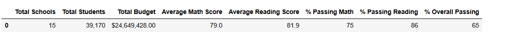
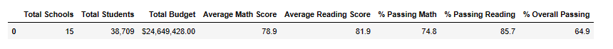

# School_District_Analysis

## Overview of Project
The purpose of this project was multifold, 1)familarize ourselves with Jupyter Notebook 2) read in and merge 2 csv files to 1 data frame 3) perform data cleanup
and 4)analyze how the results of that cleanup impacts calculations and overall results.

## Results
**How is the district summary affected?**
The affect on district totals was very minor.  Only 461 records of 39170 records (1.8%) were discarded in the calculations which led to slightly lower district averages
and totals.  As a whole, at the district level the calculations were not affected by the loss of the data.

**How is the school summary affected?**
After setting all the 9th grade score values to NaN for Thomas High School, we found that the average (mean) score in math and reading wasn't affected much.
These values stayed relatively stable.  However, the percentage of students passing math & reading and overall percentage passing fell sharply because we 
never changed the value of the Thomas student count.  Passing math percentages fell from 93% to 67% and passing reading percentages fell from 97% to 70%.  The Thomas 
High School student count stayed at 1635 so it diluted the passing percentages when we set the 9th grade values to NaN.

**How does replacing the ninth graders’ math and reading scores affect Thomas High School’s performance relative to the other schools?**
Replacing the ninth grade scores to NaN affected Thomas High School negatively.  They moved down to 8th place overall from 2nd place.  The overall passing percentage used for 
ranking the schools dropped from 91% to 65%.  This percentage was diluted when we set the 9th grade values to NaN because the overall student count stayed at 1635.

When we replaced the ninth grade scores to NaN but only calculated Thomas High School's scores based on 10th-12th graders then Thomas High School stayed
the same at 2nd place and was not impacted at all.

**How does replacing the ninth-grade scores affect the following:**
**Math and reading scores by grade**
Math and reading scores by grade would not be affected except for the Thomas High School 9th grade class scores which were all set to NaN.

**Scores by school spending**
No change for school spending averages and percentages.

**Scores by school size**
No change for school size averages and percentages.

**Scores by school type**
No change for school type averages and percentages.

## Summary
In summary, these four observations were made when replacing the ninth grade Thomas High data:

1.  When scores were set to NaN value, averages (mean) calculated for math and reading were not affected greatly at either the district or the school level.
NaN values seemed to be ignored and not considered to be zero in mean calculations.
2.  When scores were set to NaN value, percentage totals were affected because the records still existed in the dataframe and the student count was diluting the 
calculated percentages.
3.  By reducing the total student count by the number of records we set to NaN, this seemed to be the best way of keeping the data clean and with little impact
to data integrity.
4.  Overall in a dataset of this size, cleaning the data and removing rows in question seemed to have very little affect in overall totals.
